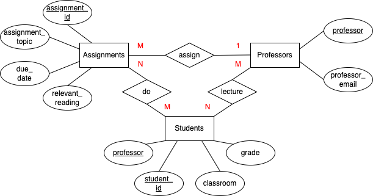

# Data Normalization and Entity-Relationship Diagramming

## Original Table

The following table, representing students' grades in courses at a university, is already in [first normal form](https://knowledge.kitchen/A_Simple_Guide_to_Five_Normal_Forms_in_Relational_Database_Theory#FIRST_NORMAL_FORM) (1NF) - all records have the same number of fields, and there is only one value per field.

| assignment_id | student_id | due_date | professor | assignment_topic                | classroom | grade | relevant_reading    | professor_email   |
| :------------ | :--------- | :------- | :-------- | :------------------------------ | :-------- | :---- | :------------------ | :---------------- |
| 1             | 1          | 23.02.21 | Melvin    | Data normalization              | WWH 101   | 80    | Deumlich Chapter 3  | l.melvin@foo.edu  |
| 2             | 7          | 18.11.21 | Logston   | Single table queries            | 60FA 314  | 25    | Dümmlers Chapter 11 | e.logston@foo.edu |
| 1             | 4          | 23.02.21 | Melvin    | Data normalization              | WWH 101   | 75    | Deumlich Chapter 3  | l.melvin@foo.edu  |
| 5             | 2          | 05.05.21 | Logston   | Python and pandas               | 60FA 314  | 92    | Dümmlers Chapter 14 | e.logston@foo.edu |
| 4             | 2          | 04.07.21 | Nevarez   | Spreadsheet aggregate functions | WWH 201   | 65    | Zehnder Page 87     | i.nevarez@foo.edu |
| ...           | ...        | ...      | ...       | ...                             | ...       | ...   | ...                 | ...               |

This data represents information about students' grades in courses at a university. The dependencies reflect the reality of how courses work in most universities.

- each course can be taught by multiple professors in different sections
- each professor might teach multiple sections of the same course
- each section meets in a specific classroom with a specific professor
- professors give assignments, with specific due dates
- a professor might give the same assignment to different sections of the same course, but with different due dates
- professors give readings to help with the assignments
- students complete assignments and receive a grade

However, it still has many problems and does not compliant with 4NF. There is no primary key, and a random selection of either one or two of the columns will violate 2NF or 3NF. Some columns are only relevant to part of the possible primary key or store attributes to an entity other than the possible primary key. There is also data redundancy because many columns are dependent on the other one, and thus there are many repetitions of value.

In this repository, I will convert this table to the [fourth normal form](https://knowledge.kitchen/A_Simple_Guide_to_Five_Normal_Forms_in_Relational_Database_Theory#Fourth_Normal_Form) (4NF).

## Modified tables

The modified tables are shown below:

| *student_id | *professor | classroom | grade | assignment_id | 
| :---------  | :--------  | :-------- | :---- | :------------ | 
| 1           | Melvin     | WWH 101   | 80    | 1             | 
| 7           | Logston    | 60FA 314  | 25    | 2             | 
| 4           | Melvin     | WWH 101   | 75    | 1             | 
| 2           | Logston    | 60FA 314  | 92    | 5             | 
| 2           | Nevarez    | WWH 201   | 65    | 4             | 
| ...         | ...        | ...       | ...   | ...           |  

| *assignment_id | due_date | assignment_topic                | relevant_reading    |
| :------------  | :------- | :------------------------------ | :------------------ |
| 1              | 23.02.21 | Data normalization              | Deumlich Chapter 3  |
| 2              | 18.11.21 | Single table queries            | Dümmlers Chapter 11 |
| 4              | 04.07.21 | Spreadsheet aggregate functions | Zehnder Page 87     |
| 5              | 05.05.21 | Python and pandas               | Dümmlers Chapter 14 |
| ...            | ...      | ...                             | ...                 |

| *professor | professor_email   |
| :--------  | :---------------- |
| Melvin     | l.melvin@foo.edu  |
| Logston    | e.logston@foo.edu |
| Nevarez    | i.nevarez@foo.edu |
| ...        | ...               |

## ER diagram
The ER diagram of these 4NF-compliant tables are shown below:

 
## Rationale
I breakdown the original table into three tables describing the attributes of three entities: students, assignments, and professors.

For table students, the columns are:
1. “student_id” PRIMARY KEY
1. “professor” PRIMARY KEY (FOREIGN KEY to table professor)
1. “classroom”
1. “assignment_id” (FOREIGN KEY to table assignment)
1. “grade”

For table assignments, the columns are:
1. “assignment_id” PRIMARY KEY
1. “assignment_topic”
1. “due_date”
1. “relevant_reading”

For table professors, the columns are:
1. “professor” PRIMARY KEY
1. “professor_email”

First, I assign “student_id” and “professor” as primary key because the combination of them is unique (one professor teaches one class of multiple sections, and one student attends one section each for many courses).

2NF: “classroom,” “assignment_id,” and “grade” are kept in the original table student because they are facts about the combination of primary key student and professor. The other two tables have one primary key and are thus compliant to 2NF.

3NF: assignments attributes like “due_date” that describes non-key column “assignment_id” violate 3NF; thus, I create a new table to store those values and assign “assignment_id” as a foreign key to the original table. Because of the same reason, the attribute column “professor_email” is also reassigned to a new professor table with “professor” as the foreign key to the original table.

4NF: there is no such concern for table professors as one name corresponds to one email address. For table assignment, all attributes are determined by id, and for each given id, only one set of attributes is possible. A student cannot attend multiple sections of the same class; thus, “classroom” cannot hold multi-valued facts. There cannot be different grades assigned to a person for the same assignment, and therefore “grade” is compliant. There can be multiple values for “assignment_id” if a student scores the same on various assignments in the same class, but “grade” and “assignment_id” are dependent on each other and thus compliant to 4NF.